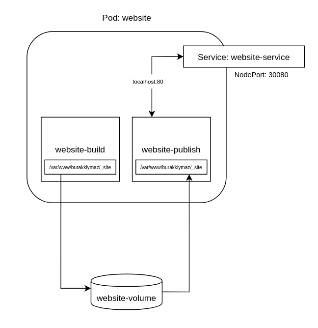

# WEBSITE
Detail of this project;
There is two container in a pod. One of container is creating a static website with using jekyll framework and other one is publishing this website using nginx. 
Especially Jekyll framework serving website itself but I configured pod like this for using two container in a pod

You can check project diagram below:

